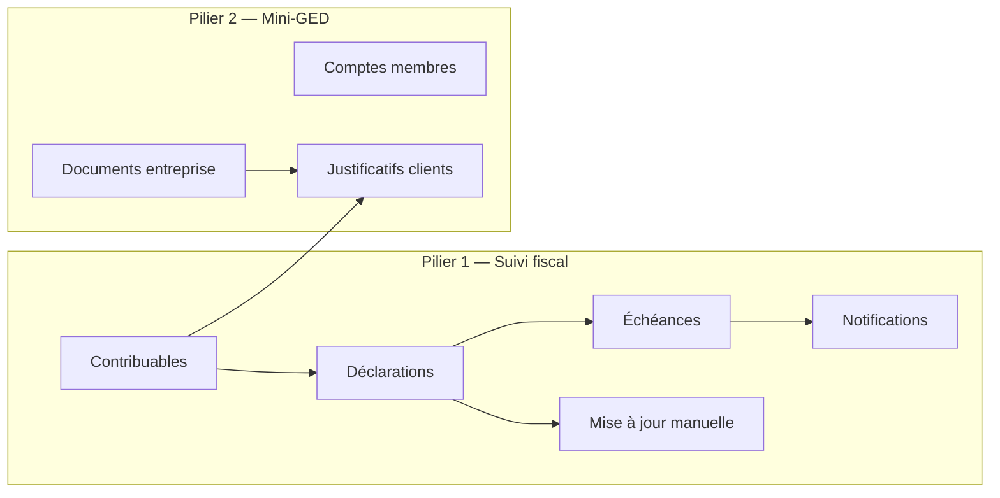
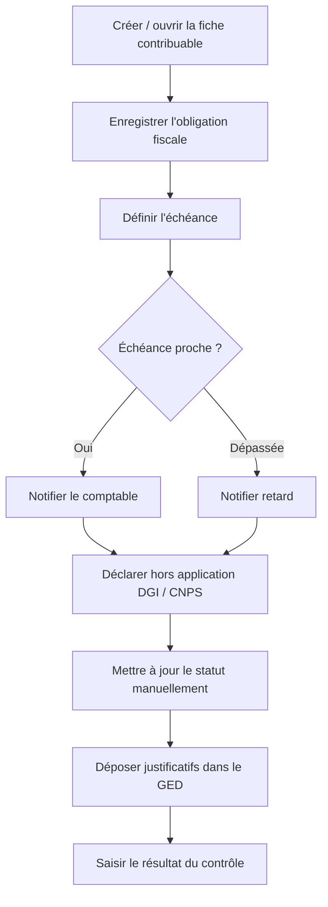
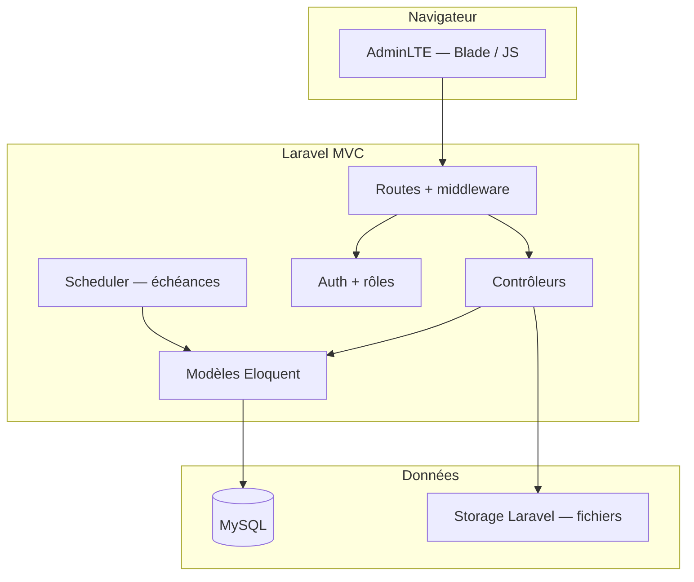
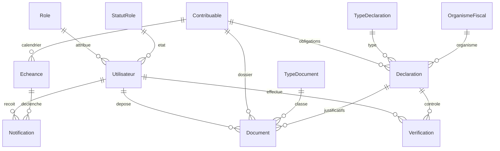

# Cahier des charges — FiscalTrack

**Application web de suivi des déclarations fiscales et mini-GED**  
Cabinet : **TIA INTERNATIONAL LTD**  
Stack : **Laravel** · **AdminLTE** · **MySQL**  
Document : reformulation du cahier des charges (Word) — août 2026

---

## Table des matières

1. [Présentation du projet](#1-présentation-du-projet)
2. [Périmètre de la solution](#2-périmètre-de-la-solution)
3. [Utilisateurs et rôles](#3-utilisateurs-et-rôles)
4. [Fonctionnalités](#4-fonctionnalités)
5. [Description détaillée des fonctionnalités](#5-description-détaillée-des-fonctionnalités)
6. [Processus métier](#6-processus-métier)
7. [Exigences fonctionnelles](#7-exigences-fonctionnelles)
8. [Exigences non fonctionnelles](#8-exigences-non-fonctionnelles)
9. [Contraintes techniques](#9-contraintes-techniques)
10. [Architecture générale](#10-architecture-générale)
11. [Modèle de données](#11-modèle-de-données)
12. [Interfaces utilisateurs](#12-interfaces-utilisateurs)
13. [Modélisation UML](#13-modélisation-des-diagrammes)
14. [Hors périmètre et évolutions](#14-hors-périmètre-et-évolutions)
15. [Livrables et critères d’acceptation](#15-livrables-et-critères-dacceptation)

---

## 1. Présentation du projet

### 1.1 Contexte

Dans le cadre d’une formation académique au sein de **TIA INTERNATIONAL LTD**, l’analyse des activités du cabinet a permis d’identifier les difficultés quotidiennes et de proposer une solution numérique adaptée.

TIA INTERNATIONAL LTD est un cabinet de comptabilité et de gestion fiscale. Ses équipes manipulent un volume important de pièces : factures, reçus, devis, avis d’imposition, quittances, rapports destinés aux clients et aux partenaires.

Le cabinet utilise déjà un système de gestion intégré (**Sage**). Cet outil ne couvre pas suffisamment :

- l’organisation, la recherche et l’accès à distance des documents ;
- le suivi des **échéances fiscales** des clients (contribuables) ;
- l’alerte avant les dates limites de déclaration / paiement.

Les documents restent en grande partie **physiques** (classeurs). Les factures générées depuis le site du cabinet sont souvent imprimées puis classées, sans dépôt numérique central. Les rappels d’échéances se font manuellement : avec un grand nombre de contribuables, le risque d’oubli et la perte de temps sont élevés.

### 1.2 Problèmes identifiés

| Problème | Conséquence |
| --- | --- |
| Documentation mal organisée, non sécurisée | Perte de pièces, justificatifs introuvables |
| Absence de recherche rapide | Temps perdu pour retrouver un justificatif client |
| Stockage essentiellement papier | Pas d’accès distant pour les comptables |
| Factures du site non centralisées | Difficulté à retrouver une facture |
| Pas d’alerte d’échéance fiscale | Rappels manuels, retards, pénalités possibles |

### 1.3 Problématique

Comment concevoir et mettre en œuvre une **application web** qui :

1. assure le **suivi des déclarations fiscales** des clients (échéances, statuts, justificatifs, mise à jour manuelle de la situation) ;
2. intègre un **mini-GED** pour les documents de l’entreprise et les dossiers associés aux comptes des membres (équipe) et des contribuables.

### 1.4 Objectifs

#### Objectif général

Mettre en place **FiscalTrack**, une application web permettant :

- de **suivre les déclarations fiscales** de chaque contribuable (dates limites, statuts, alertes) ;
- de **centraliser, classer, rechercher et consulter** les documents de l’entreprise et les pièces liées aux clients ;
- de **gérer les comptes des membres** de l’équipe (création, rôles, activation / désactivation) ;
- d’accéder aux données **à distance**, pendant les heures de travail du cabinet.

#### Objectifs spécifiques

1. Gérer les documents (enregistrement, recherche, consultation, modification, téléchargement, impression, archivage, filtres).
2. Rendre les données accessibles en ligne.
3. Suivre les déclarations fiscales (échéances, notifications, marquage « déclaré », justificatifs).
4. Relier chaque contribuable à son dossier (identité fiscale + documents associés).
5. Permettre au comptable de **mettre à jour manuellement** la situation d’un contribuable (déclaré / en règle, dates, commentaire) après contrôle hors application.
6. Déposer dans le mini-GED les factures et pièces du cabinet (**import manuel**, sans récupération automatique).

---

## 2. Périmètre de la solution

FiscalTrack s’articule autour de **deux piliers**.

| Pilier | Contenu |
| --- | --- |
| **Suivi des déclarations** | Fiche contribuable, obligations (IGS, TDL, etc.), échéances, statuts, alertes, justificatifs après déclaration, **mise à jour manuelle** de la situation |
| **Mini-GED** | Comptes des membres de l’équipe ; documents d’entreprise (factures, reçus, devis, rapports) ; pièces fiscales (avis d’imposition, quittances, ACF) liées à un client ou à une déclaration |

**Pas d’intégration externe.** FiscalTrack ne communique avec aucun système tiers (Sage, DGI, CNPS, site du cabinet). Les déclarations, statuts, résultats de contrôle et documents sont **saisis et mis à jour à la main** par les membres. Sage reste l’outil comptable du cabinet ; FiscalTrack le complète sur le GED et le suivi des échéances, sans échange de données.

---

## 3. Utilisateurs et rôles

Les comptes membres sont créés **uniquement par l’administrateur**. Il n’y a pas d’auto-inscription.

| Rôle | Responsabilités |
| --- | --- |
| **Administrateur** | Gérer les comptes membres (créer, modifier, consulter, rechercher, désactiver, supprimer). Superviser l’ensemble des opérations du système. |
| **Comptable** | Se connecter / se déconnecter. Gérer les documents (mini-GED). Gérer les contribuables. Suivre les déclarations. Consulter et traiter les notifications d’échéances. |

---

## 4. Fonctionnalités

### 4.1 Fonctionnalités de base

| Module | Fonctionnalités |
| --- | --- |
| Authentification | Connexion, déconnexion, contrôle d’accès aux pages protégées |
| Comptes membres | Créer, rechercher, modifier, consulter, désactiver, supprimer un compte |

### 4.2 Fonctionnalités métier

| Module | Fonctionnalités |
| --- | --- |
| **Mini-GED — Documents** | Ajouter (métadonnées + fichier). Consulter la liste et l’aperçu. Modifier. Supprimer. Télécharger. Rechercher. Filtrer / classer. Imprimer. |
| **Contribuables** | Ajouter (fiche + document associé). Consulter. Modifier. Supprimer. Télécharger les pièces. Rechercher. Filtrer. |
| **Déclarations fiscales** | Enregistrer une déclaration. Consulter la liste. Modifier le statut **manuellement**. Notifier une échéance proche. Saisir le résultat du contrôle (DGI / CNPS) après vérification hors application. Télécharger les justificatifs après déclaration. |
| **Notifications** | Détecter une échéance proche. Alerter une échéance dépassée. Consulter. Marquer comme lue. |

---

## 5. Description détaillée des fonctionnalités

Chaque fonctionnalité est décrite avec : nom, description, acteur, préconditions, déroulement, résultat, exceptions.

### 5.1 Module authentification

#### Se connecter

| Élément | Détail |
| --- | --- |
| **Description** | Authentifier un membre afin d’accéder à son espace selon son rôle. |
| **Acteurs** | Administrateur, comptable |
| **Préconditions** | Un compte a été créé par l’administrateur. Le compte est **actif**. L’utilisateur connaît son e-mail et son mot de passe. |
| **Déroulement** | 1. L’utilisateur ouvre l’application. 2. Il saisit e-mail et mot de passe, puis clique sur **Se connecter**. 3. Le système vérifie les identifiants et le statut du compte. 4. En cas de succès, redirection vers l’espace de travail (tableau de bord admin ou comptable). |
| **Résultat** | Session ouverte. Accès aux menus autorisés par le rôle. |
| **Exceptions** | Identifiants incorrects, champs vides, compte inexistant, compte désactivé. Message : accès refusé. |

> **Note de reformulation.** Le document source prévoyait un parcours différent pour l’admin (mot de passe seul) et le comptable (e-mail + mot de passe). La version retenue est une **connexion unique** (e-mail + mot de passe), plus sûre et plus simple, avec redirection selon le rôle.

#### Se déconnecter

| Élément | Détail |
| --- | --- |
| **Description** | Fermer la session de façon sécurisée. |
| **Acteurs** | Administrateur, comptable |
| **Préconditions** | Une session est active. |
| **Déroulement** | 1. L’utilisateur clique sur **Déconnexion** (profil ou menu). 2. Confirmation : « Voulez-vous vraiment vous déconnecter ? » 3. **Annuler** : la session reste ouverte. **Confirmer** : la session est fermée, redirection vers la page de connexion. |
| **Résultat** | Session invalidée. Les pages protégées ne sont plus accessibles sans nouvelle connexion. |
| **Exceptions** | Erreur de fermeture de session. Tentative d’accès à une page protégée après déconnexion → redirection login. |

### 5.2 Module comptes membres (mini-GED / administration)

#### Créer un compte

| Élément | Détail |
| --- | --- |
| **Description** | L’administrateur crée un compte membre (comptable ou autre rôle autorisé). |
| **Acteur** | Administrateur |
| **Préconditions** | Administrateur connecté. Informations du membre disponibles. |
| **Déroulement** | 1. Menu **Gestion des comptes** → **Créer un compte**. 2. Saisie : nom, prénom, e-mail, téléphone, mot de passe, rôle, statut. 3. Contrôle : e-mail unique, champs obligatoires, format e-mail. 4. Enregistrement. Message : « Compte créé avec succès ». |
| **Résultat** | Le membre apparaît dans la liste. Il peut se connecter si le statut est actif. |
| **Exceptions** | Champs vides, e-mail invalide ou déjà utilisé. |

#### Rechercher / consulter un compte

| Élément | Détail |
| --- | --- |
| **Description** | Retrouver un membre par nom, e-mail, rôle ou statut, et consulter sa fiche. |
| **Acteur** | Administrateur |
| **Préconditions** | Administrateur connecté. |
| **Déroulement** | Liste des comptes, barre de recherche et filtres (rôle, statut). Clic sur un compte → fiche détaillée. |
| **Résultat** | Affichage des informations du compte (sans afficher le mot de passe en clair). |
| **Exceptions** | Aucun résultat. |

#### Modifier un compte

| Élément | Détail |
| --- | --- |
| **Description** | Mettre à jour les informations d’un compte existant. |
| **Acteur** | Administrateur |
| **Préconditions** | Administrateur connecté. Le compte existe. |
| **Déroulement** | 1. Liste des comptes (recherche / filtres si besoin). 2. Action **Modifier**. 3. Formulaire pré-rempli. 4. Enregistrement après validation. |
| **Résultat** | Informations mises à jour. Liste actualisée. Message de confirmation. |
| **Exceptions** | Champs obligatoires vides, e-mail invalide ou déjà utilisé. |

#### Désactiver un compte

| Élément | Détail |
| --- | --- |
| **Description** | Empêcher un membre de se connecter sans supprimer son historique. |
| **Acteur** | Administrateur |
| **Préconditions** | Administrateur connecté. Compte existant et actif. |
| **Déroulement** | Action **Désactiver** + confirmation. Statut passé à **inactif**. |
| **Résultat** | Connexion refusée pour ce compte. Le compte reste visible dans la liste (filtre « inactif »). |
| **Exceptions** | Tentative de désactiver son propre compte administrateur unique. |

#### Supprimer un compte

| Élément | Détail |
| --- | --- |
| **Description** | Retirer un compte (suppression logique recommandée : statut « supprimé »). |
| **Acteur** | Administrateur |
| **Préconditions** | Administrateur connecté. |
| **Déroulement** | Action **Supprimer** + confirmation explicite. |
| **Résultat** | Le compte n’est plus utilisable. Il n’apparaît plus dans la liste active. |
| **Exceptions** | Compte déjà supprimé. Suppression du dernier administrateur interdite. |

### 5.3 Module mini-GED — documents d’entreprise

Les documents concernés comprennent notamment : factures d’achat / de vente, reçus, devis, avis d’imposition, quittances, ACF, rapports.

#### Ajouter un document

| Élément | Détail |
| --- | --- |
| **Description** | Enregistrer les métadonnées d’un document et importer le fichier numérique. |
| **Acteur** | Comptable (et administrateur) |
| **Préconditions** | Utilisateur connecté. Fichier disponible (PDF, image, etc.). |
| **Déroulement** | 1. **Documents** → **Ajouter**. 2. Saisie : nom, type, date, numéro, fournisseur / émetteur, montant (si applicable), contribuable lié (optionnel), déclaration liée (optionnel). 3. Import du fichier. 4. Contrôles (type, taille, champs obligatoires). 5. Métadonnées enregistrées en **MySQL** ; fichier stocké via le disque Laravel (`storage`). |
| **Résultat** | Document listé, consultable, téléchargeable. |
| **Exceptions** | Fichier manquant, format non autorisé, taille excessive, champs incomplets. |

#### Consulter, rechercher, filtrer

| Élément | Détail |
| --- | --- |
| **Description** | Parcourir les documents, afficher l’aperçu, rechercher par mot-clé, filtrer par type, date, contribuable, statut. |
| **Acteur** | Comptable, administrateur |
| **Préconditions** | Utilisateur connecté. |
| **Déroulement** | Liste + aperçu. Recherche textuelle. Filtres. Ouverture de la fiche. |
| **Résultat** | Document trouvé rapidement, y compris à distance. |
| **Exceptions** | Aucun résultat. Fichier introuvable dans le stockage. |

#### Modifier / supprimer / télécharger / imprimer

| Action | Comportement |
| --- | --- |
| **Modifier** | Formulaire pré-rempli. Mise à jour des métadonnées ; remplacement optionnel du fichier. |
| **Supprimer** | Confirmation. Retrait de la liste (suppression logique préférable pour l’archivage). |
| **Télécharger** | Téléchargement du fichier original depuis le stockage. |
| **Imprimer** | Ouverture / impression après téléchargement ou depuis l’aperçu. |

### 5.4 Module contribuables (clients)

#### Ajouter un contribuable

| Élément | Détail |
| --- | --- |
| **Description** | Créer la fiche d’un client / contribuable et y associer au moins un document (pièce d’identité fiscale, contrat, etc.). |
| **Acteur** | Comptable |
| **Préconditions** | Utilisateur connecté. |
| **Données principales** | Nom, NIU, régime / classe, catégorie, téléphone, lieu, loyer, bail, année, montants (impôt payé, précompte, timbres, frais de paiement), frais de suivi. |
| **Déroulement** | Formulaire + import du document associé → enregistrement. |
| **Résultat** | Contribuable créé, visible dans la liste, dossier documentaire initialisé. |
| **Exceptions** | NIU déjà existant, champs obligatoires vides. |

#### Consulter, modifier, rechercher, filtrer, supprimer

Même logique que pour les documents : liste, recherche (nom, NIU), filtres (régime, catégorie, année, statut de déclaration), fiche détaillée avec documents et déclarations liés.

### 5.5 Module déclarations fiscales

#### Enregistrer une déclaration

| Élément | Détail |
| --- | --- |
| **Description** | Enregistrer une obligation fiscale à suivre pour un contribuable (type, organisme, période, dates). |
| **Acteur** | Comptable |
| **Préconditions** | Contribuable existant. |
| **Déroulement** | 1. Choisir le contribuable. 2. Type de déclaration (ex. IGS, TDL) et organisme (DGI, CNPS). 3. Période / échéance. 4. Statut initial (ex. **à déclarer**). |
| **Résultat** | Déclaration créée. Une échéance est associée. Une notification pourra être déclenchée. |

#### Modifier le statut

Statuts typiques : **à déclarer** → **déclaré** → **justificatif déposé** (avis, quittance, ACF selon le cas). Le comptable marque un contribuable comme déclaré et joint les pièces.

#### Mettre à jour la situation (manuellement)

Le comptable contrôle la situation du contribuable **en dehors** de FiscalTrack (portails DGI / CNPS, dossier papier, Sage, etc.). Il saisit ensuite dans l’application le résultat : en règle / non, date, commentaire, statut de la déclaration.

> FiscalTrack **n’appelle aucun service externe** et n’affiche pas de flux temps réel depuis la DGI ou la CNPS. Toute mise à jour (statut, dates, montants, pièces) est **manuelle**.

#### Justificatifs après déclaration

Téléchargement / dépôt des avis d’imposition, quittances et ACF dans le mini-GED, liés à la déclaration et au contribuable.

### 5.6 Module notifications

| Élément | Détail |
| --- | --- |
| **Description** | Alerter les **membres connectés** (notification in-app) avant une échéance et après dépassement. Aucun envoi vers un système ou un canal externe. |
| **Acteur** | Système (détection) ; comptable / administrateur (consultation). |
| **Préconditions** | Échéances enregistrées. |
| **Déroulement** | 1. Le système compare la date du jour aux échéances. 2. Échéance proche → notification « à venir ». 3. Échéance dépassée et non soldée → notification « en retard ». 4. L’utilisateur consulte la liste et marque comme lue. |
| **Canaux** | Notification **in-app** (dans FiscalTrack). |
| **Résultat** | Le cabinet anticipe les dates limites sans relance manuelle exhaustive. |
| **Exceptions** | Échéance sans destinataire. |

---

## 6. Processus métier

### 6.1 Processus de suivi d’une déclaration

**Scénario nominal**

1. Le comptable enregistre le contribuable et son dossier.
2. Il crée la déclaration (type, organisme, période).
3. Le système surveille l’échéance et notifie.
4. Le comptable effectue la déclaration **hors application** (portail DGI / CNPS ou autre).
5. Il **met à jour manuellement** le statut dans FiscalTrack et dépose les justificatifs (avis, quittance, ACF).
6. Il saisit le résultat du contrôle (en règle / non, date, commentaire).

### 6.2 Processus mini-GED

1. Un document arrive (papier scanné, facture exportée du site du cabinet, justificatif fiscal).
2. Le comptable l’importe avec ses métadonnées et le rattache éventuellement à un contribuable ou à une déclaration.
3. Le fichier est stocké par Laravel (`storage`) ; les métadonnées sont enregistrées en MySQL.
4. Tout membre autorisé retrouve le document par recherche ou filtre, y compris à distance.

### 6.3 Acteurs et responsabilités (vue processus)

| Acteur | Rôle dans le processus |
| --- | --- |
| Administrateur | Crée et maintient les comptes membres. Supervise. |
| Comptable | Alimente le GED, gère les contribuables, suit les déclarations, traite les alertes. |
| Système | Contrôle d’accès, stockage, détection d’échéances, notifications. |
| Organismes (référentiel) | DGI, CNPS : simples libellés dans FiscalTrack. **Aucune connexion** vers leurs systèmes. |

---

## 7. Exigences fonctionnelles

Après implémentation, l’application doit permettre de :

| ID | Exigence |
| --- | --- |
| EF-01 | Se connecter et se déconnecter de façon sécurisée |
| EF-02 | Gérer les comptes membres (CRUD, recherche, désactivation) |
| EF-03 | Enregistrer un document (métadonnées + fichier) |
| EF-04 | Rechercher, consulter, prévisualiser un document |
| EF-05 | Modifier les informations d’un document |
| EF-06 | Télécharger et imprimer un document |
| EF-07 | Classer les documents à l’aide de filtres |
| EF-08 | Créer un contribuable et lui associer un document |
| EF-09 | Accéder aux données à distance |
| EF-10 | Enregistrer les dates limites de chaque contribuable |
| EF-11 | Mettre à jour le statut d’une échéance / déclaration |
| EF-12 | Importer manuellement les factures et pièces du cabinet dans le mini-GED |
| EF-13 | Envoyer des rappels (notification in-app) avant échéance |
| EF-14 | Consulter les notifications et les marquer comme lues |
| EF-15 | Saisir manuellement le résultat d’un contrôle (DGI / CNPS ou autre) sur la fiche |

---

## 8. Exigences non fonctionnelles

### 8.1 Sécurité

- Authentification obligatoire pour toute page métier.
- Mots de passe stockés de façon sécurisée (hachage, jamais en clair).
- Protection de la base contre les injections SQL (requêtes préparées).
- Contrôle d’accès par rôle (un comptable ne gère pas les comptes membres).
- Session invalidée à la déconnexion ; pas d’accès aux pages protégées ensuite.

### 8.2 Performance

- Temps de réponse acceptable pour les actions courantes (listes, formulaires).
- Téléchargement et aperçu des documents efficaces.

### 8.3 Compatibilité

- Compatible avec les navigateurs courants (cible de test : Microsoft Edge).
- Interface adaptée aux différentes tailles d’écran (desktop et mobile).

### 8.4 Disponibilité

- Disponible pendant les heures de travail du cabinet.
- Consultation des données à distance dès lors que l’application Laravel et MySQL sont joignables.

---

## 9. Contraintes techniques

| Élément | Choix |
| --- | --- |
| Type d’application | Application web responsive (mobile et desktop) |
| Framework applicatif | **Laravel** (PHP, architecture MVC) |
| Interface (template) | **AdminLTE** (Blade) |
| Front-end | HTML, CSS, JavaScript (inclus dans AdminLTE / Bootstrap) |
| ORM / accès données | Eloquent (Laravel) |
| Base de données | **MySQL** (métadonnées et données métier) |
| Fichiers (mini-GED) | Stockage Laravel (`storage/app`), servi de façon contrôlée |
| Authentification | Laravel Auth + middleware de rôles |
| Tâches planifiées | Laravel Scheduler (détection des échéances / notifications) |
| IDE | Visual Studio Code |
| Navigateur de test | Microsoft Edge |

Toutes les données métier (utilisateurs, contribuables, déclarations, échéances, métadonnées des documents) sont stockées en **MySQL**. Les fichiers du mini-GED sont gérés par le **storage Laravel**, avec un chemin enregistré en base.

---

## 10. Architecture générale

L’application est **autonome** : pas d’API ni d’échange avec Sage, la DGI, la CNPS ou le site du cabinet. Les mises à jour sont faites par les utilisateurs dans les écrans Laravel.

**Principe MVC (Laravel)**

- **Vue** : vues Blade basées sur le template **AdminLTE** (connexion, tableau de bord, GED, contribuables, déclarations, notifications).
- **Contrôleur** : actions métier (CRUD, upload, changement de statut), protégées par middleware.
- **Modèle** : Eloquent vers **MySQL** ; fichiers via le disque de stockage Laravel.
- **Scheduler** : détection des échéances proches ou dépassées et création des notifications.

---

## 11. Modèle de données

### 11.1 Entités principales

| Entité | Attributs (principaux) | Rôle | Clés étrangères |
| --- | --- | --- | --- |
| **Utilisateur** | idUtilisateur, nom, prénom, téléphone, email, motDePasse, dateCreation | Membre de l’équipe (admin, comptable) | idRole, idStatutRole |
| **Role** | idRole, libelleRole | Administrateur, comptable | — |
| **StatutRole** | idStatutRole, libelleStatutRole | Actif, inactif, supprimé | — |
| **Document** | idDocument, date, montant, nomDocument, fournisseur, numeroDoc, cheminFichier | Pièce numérique (entreprise ou justificatif client) | idUtilisateur, idContribuable, idTypeDocument, idDeclaration |
| **TypeDocument** | idTypeDocument, categorie, description | Facture vente/achat, avis, quittance, devis, etc. | — |
| **Contribuable** | idContribuable, nom, NIU, regimeClasse, categorie, loyer, bail, telephone, lieu, montantPayer, annee, impotPaye, precompte, timbres, fraisPaiement | Client soumis aux obligations fiscales | idFraisSuivi, idIgs, idEcheance |
| **Declaration** | idDeclaration, statut, dateCreation | Obligation fiscale à suivre | idTypeDeclaration, idOrganisme, idContribuable |
| **Echeance** | idEcheance, periode, statut, dateLimite | Dates limites de déclaration / paiement | idAvis, idQuittance, idAcf |
| **TypeDeclaration** | idTypeDeclaration, periodicite, libelle | IGS, TDL, … | — |
| **OrganismeFiscal** | idOrganisme, nom | DGI, CNPS | — |
| **Verification** | idVerification, resultat, dateVerification, commentaire | Résultat du contrôle **saisi manuellement** par le comptable | idDeclaration, idUtilisateur, idOrganisme, idContribuable |
| **IgsPaiement** | idIgs, t1, t2, t3, t4, tdl | Montants trimestriels IGS et TDL | — |
| **FraisSuivi** | idFraisSuivi, payer, nonPayer | Frais de suivi de déclaration du cabinet | — |
| **AvisImposition** | idAvis, avisDateIgs, avisDateBail, avisDatePrecompte | Dates liées à l’avis d’imposition | — |
| **Quittance** | idQuittance, quitDateIgs, quitDateBail, quitDatePrecompte | Dates liées à la quittance | — |
| **Acf** | idAcf, dateDebut, dateFin | Période de validité de l’ACF | — |
| **Notification** | idNotification, message, dateNotification, lu | Alertes d’échéances | idEcheance, idUtilisateur |

### 11.2 Relations

| Entité | Relie | Description |
| --- | --- | --- |
| Document | Utilisateur, Contribuable, TypeDocument, Declaration | Un document est déposé par un membre, typé, et éventuellement lié à un client et/ou une déclaration |
| Contribuable | FraisSuivi, IgsPaiement, Echeance | Un client a des frais de suivi, des paiements IGS/TDL et des échéances |
| Declaration | TypeDeclaration, OrganismeFiscal, Contribuable | Une déclaration appartient à un client, un type et un organisme |
| Verification | Declaration, Utilisateur, Organisme, Contribuable | Trace du contrôle effectué par un membre |
| Notification | Echeance, Utilisateur | Une alerte vise un membre à propos d’une échéance |

---

## 12. Interfaces utilisateurs

| Écran | Public | Contenu |
| --- | --- | --- |
| Connexion | Tous | E-mail, mot de passe, messages d’erreur |
| Tableau de bord | Selon rôle | Synthèse : échéances proches, documents récents, notifications non lues |
| Gestion des comptes | Administrateur | Liste, recherche, filtres, création / édition |
| Documents (GED) | Comptable, admin | Liste, aperçu, upload, filtres, actions |
| Contribuables | Comptable, admin | Liste, fiche, documents et déclarations liés |
| Déclarations | Comptable, admin | Liste par statut, changement de statut **manuel**, saisie du résultat de contrôle, justificatifs |
| Notifications | Tous (connectés) | Liste, lu / non lu, lien vers l’échéance |

L’interface s’appuie sur **AdminLTE** (sidebar, navbar, cartes, tableaux, formulaires). Elle reste utilisable sur mobile (menu repliable).

---

## 13. Modélisation des diagrammes

Les diagrammes suivants font partie du dossier de conception (à produire / joindre au mémoire).

### 13.1 Diagramme de cas d’utilisation

**Acteurs** : Administrateur, Comptable, Système.

**Cas d’utilisation Administrateur** : se connecter, se déconnecter, créer / modifier / consulter / rechercher / désactiver / supprimer un compte, superviser les opérations.

**Cas d’utilisation Comptable** : se connecter, se déconnecter, gérer les documents, gérer les contribuables, gérer les déclarations, mettre à jour manuellement les statuts et le résultat de contrôle, consulter les notifications, télécharger les justificatifs.

**Cas d’utilisation Système** : détecter les échéances, créer les notifications.

### 13.2 Diagramme de séquence (connexion — exemple)

1. L’utilisateur saisit ses identifiants sur la vue Blade de connexion AdminLTE.
2. Laravel Auth vérifie l’e-mail, le mot de passe et le statut du compte (MySQL).
3. Si OK : session + redirection vers le tableau de bord AdminLTE selon le rôle.
4. Si KO : message d’erreur sur la page de connexion.

### 13.3 Autres diagrammes à fournir

- Diagramme de classes (aligné sur le modèle de données).
- Diagramme d’activités du suivi d’une déclaration.
- Architecture MVC (voir section 10).

---

## 14. Hors périmètre et évolutions

Le document de présentation initial mentionnait aussi :

- une **messagerie interne** (remplacer les échanges WhatsApp pour les informations confidentielles) ;
- l’**attribution et le suivi des tâches** du personnel.

Ces sujets **ne font pas partie du périmètre V1** de FiscalTrack, centré sur :

1. le suivi des déclarations fiscales des clients ;
2. le mini-GED (comptes membres + documents de l’entreprise et des dossiers clients).

**Également hors V1 :** toute communication ou synchronisation avec un système externe (Sage, portails DGI / CNPS, site du cabinet, API). Les mises à jour se font exclusivement **à la main** dans FiscalTrack.

Ils pourront constituer des évolutions ultérieures.

---

## 15. Livrables et critères d’acceptation

### 15.1 Livrables

- Application web **Laravel** avec interface **AdminLTE**.
- Base **MySQL** (migrations Laravel) et stockage des fichiers du mini-GED.
- Comptes de démonstration (1 administrateur, au moins 1 comptable).
- Le présent cahier des charges.
- Diagrammes UML (cas d’utilisation, séquence, classes).

### 15.2 Critères d’acceptation (V1)

- Un administrateur peut créer un comptable qui se connecte ensuite.
- Un document d’entreprise peut être importé, retrouvé par recherche, téléchargé.
- Un contribuable peut être créé avec un document associé.
- Une déclaration avec échéance génère une notification à l’approche / au dépassement de la date.
- Le statut d’une déclaration peut être passé **manuellement** à « déclaré » et un justificatif joint.
- Le comptable peut **saisir** un résultat de contrôle (en règle / non, date, commentaire) sans appel à un système externe.
- Un utilisateur déconnecté ne peut plus ouvrir une page métier.

---

*Reformulation à partir du fichier `CAHIER DE CHARGE.docx` (auteur : durel) et de la présentation projet. Cadrage produit : suivi fiscal des clients + mini-GED. Stack : Laravel, AdminLTE, MySQL. Aucune intégration externe : mises à jour manuelles.*
